# Multifunctional Bluetooth Gesture Controller  
**1st Prize & PCB Award Winner of Tsinghua University 26th Hardware Design Competition**

---

## 📽 Demonstration Video  

---

## 🚧 Project Status & Pending Features  
> This project is under active development. Current pending features:

| Module | Pending Items |
|--------|---------------|
| Qt GUI | • Button & Combox response incomplete • Layout not finalized |
| Unity3D | • Scene not fully built |
| Gesture Recognition | • Gyroscope roll angle not utilized |
| File System | • SPIFFS file reading incomplete |
| Bluetooth | • Serial data processing incomplete |

**Hardware Upgrade Plan**: Next PCB version will integrate MPU9250 and TFT display

---

## ✨ Core Features

### 🖱 Bluetooth HID Control
Complete mouse/keyboard control via gestures:
- Basic cursor control
- Click/Double-click/Drag operations
- Keyboard shortcuts triggering
- Scroll wheel simulation

### 🎛 Custom Gesture System
Qt-based GUI supports:

### 🕹 Motion Capture
Unity3D-based visualization:
- Real-time gesture mapping
- 3D hand model control
- Motion data visualization

---

## 🖼 Project Preview

### PCB Design

### Hardware Assembly

### Gesture Recognition Demo

### Unity3D Visualization

---

## 🛠 Technical Specifications

### Hardware Components
| Module | Model | Function |
|--------|-------|----------|
| MCU | ESP32 | Data processing & Bluetooth |
| Sensor | MPU6050 | Gesture capture |
| Storage | SPIFFS | Gesture template storage |
| Communication | HC-05 | Bluetooth data transfer |

### Design Reference
PCB design inspired by [peng-zhihui's](https://github.com/peng-zhihui) open-source projects with optimizations:
- Improved power management
- Optimized sensor placement
- Impedance matching adjustments

### Resource Attribution
Unity3D hand model source: [CSDN Hand Model Tutorial](https://blog.csdn.net/CTangZe/article/details/127111280)

---

# 多功能蓝牙手势控制器  
**清华大学第26届硬件设计大赛一等奖&PCB奖作品**

---

## 📽 演示视频  

---

## 🚧 项目状态与待完善功能  
> 本项目仍在持续开发中，以下是待完善功能列表：

| 功能模块 | 待完善点 |
|----------|----------|
| Qt上位机 | • Button & Combox响应未完成 • 页面布局未锁定 |
| Unity3D | • 场景未搭建完成 |
| 手势识别 | • 未使用陀螺仪翻滚角 |
| 文件系统 | • SPIFFS文件读取未完成 |
| 蓝牙通信 | • 串口信息处理未完成 |

**硬件改进计划**：后续将打新版PCB，集成MPU9250和TFT屏幕

---

## ✨ 核心功能

### 🖱 蓝牙键鼠控制
通过手势实现完整的鼠标键盘操作：
- 基础光标控制
- 点击/双击/拖拽操作
- 键盘快捷键触发
- 滚轮模拟控制

### 🎛 手势自定义系统
基于Qt开发的上位机支持：

```mermaid
graph LR
A[手势录制] --> B[动作分析]
B --> C[特征提取]
C --> D[模板存储]
D --> E[实时匹配]
```

### 🕹 动作捕捉
Unity3D实现的手部动作可视化：
- 实时手势映射
- 3D手部模型控制
- 动作数据可视化

---

## 🖼 项目预览

### PCB设计

### 硬件装配

### 手势识别演示

### Unity3D效果

---

## 🛠 技术说明

### 硬件组成
| 模块 | 型号 | 功能 |
|------|------|------|
| 主控 | ESP32 | 数据处理与蓝牙通信 |
| 传感器 | MPU6050 | 手势动作捕捉 |
| 存储 | SPIFFS | 手势模板存储 |
| 通信 | HC-05 | 蓝牙数据传输 |

### 设计参考
PCB设计参考了[稚晖君](https://github.com/peng-zhihui)的开源项目，并进行了以下优化：
- 电源管理电路改进
- 传感器布局优化
- 阻抗匹配调整

### 资源引用
Unity3D手部素材来源：[CSDN-手部模型教程](https://blog.csdn.net/CTangZe/article/details/127111280)

---

---
